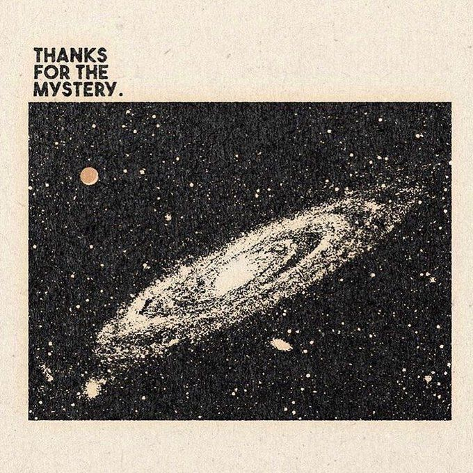

# Portfolio

Welcome to my portfolio for 6.1040! Here, you'll find all of the assignments I've completed for the class.

# About Me

Hi! My name is Amber Lien, and I'm a senior at MIT studying computer science and electrical engineering.
I'm interested in software engineering, computer systems, and AI.

Some fun facts about me:

1. I jump between many hobbies -- drawing, crocheting, playing the piano, watching F1, etc.
2. I love baking -- I've made cookies, cream puffs, fruit tarts, and more!
3. I like ducks, space, [ducks in space](https://kurzgesagt.org/)!

And here's an image I currently like:

# Table of Contents

[Assignment 1](assignments/assignment1.md)
