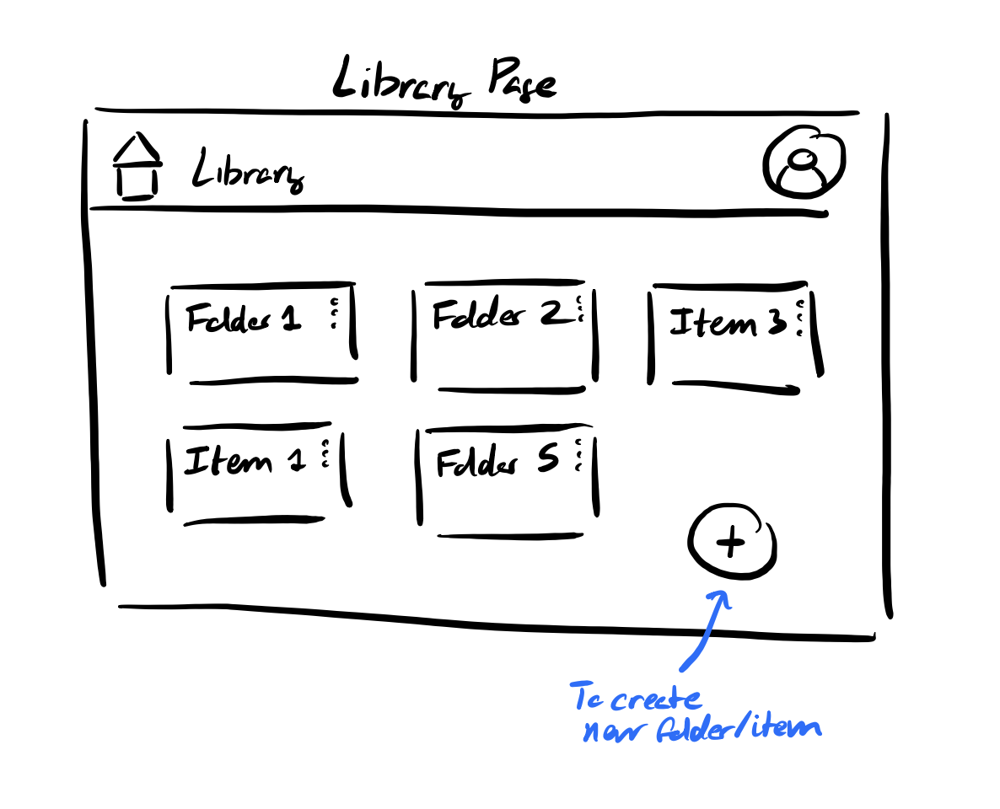

# User Journey

Ali recently read a news article about a promising gene therapy that could slow the progression of Huntington's disease. Curious to learn more, she searches for academic papers on teh topic. As she begins skimming a dense research article, she realizes that much of the terminology is unfamiliar and the explanations are highly technical. Seeking assistance, Ali opens **MediLex** to help her navigate the paper.

She starts by uploading the research paper into MediLex using the File Upload feature.

With the paper accessible and open in the app, Ali initiates a new conversation with **AskMedi** to interact with a knowledgeable chatbot; she titles the conversation "Huntington's Research".

Encountering a particularly dense paragraph, she copies and pastes the text into AskMedi, requesting a simplified summary. The chatbot returns an explanation that allows her to grasp the main ideas quickly. Curious about a specific term, Ali asks AskMedi to define it. Through this back-and-forth, Ali can clarify confusing sections without losing her place in the paper.

When she finishes reading, Ali wants to keep her resources organized for future reference. in the **Library**, she creates a folder titled "Huntington's".

She moves both the uploaded paper and the AskMedi conversation into it.

Later, as she discovers another relevant paper, she uploads it to MediLex, starts a fresh conversation with AskMedi, and adds the new file and conversation to the same folder. Over time, her folder grows into a structured, easily navigable repository of papers and discussions, enabling Ali to continue learning.
